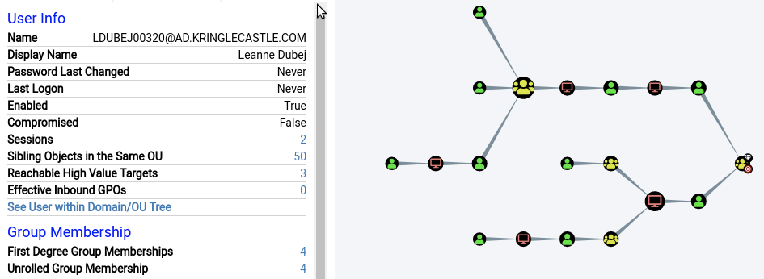

## ADPrivDiscovery

Provided an ova, this ova hhas bloodhound setup and allows for utilization to analyze the ad structure,

Since we need kerberosable users we utilized predefined search queries in order to find the paths availables.

Which gives us the answer
