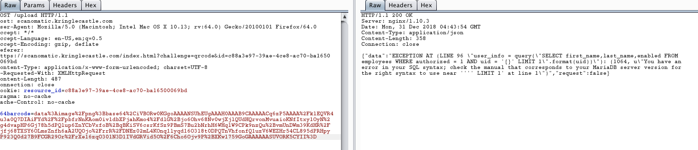
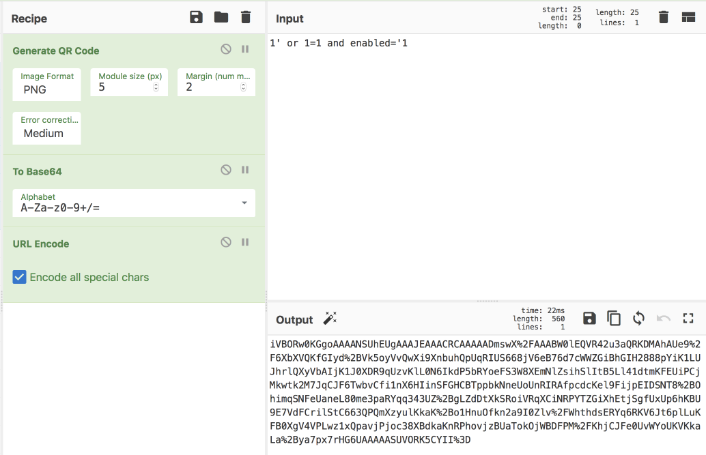
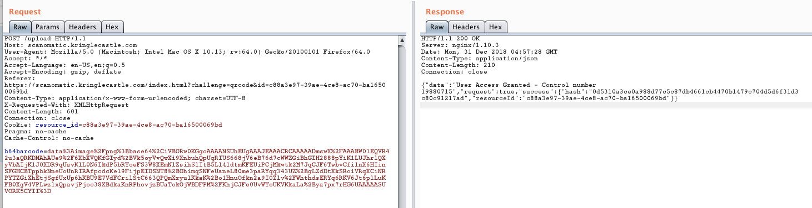

## Badge Challege

This one was pretty cool, I wish they had complicated it a bit further with utilization of the camera. We have an example badge which we can utilize to understand the format of the QR code, but this ended up not mattering.

Here is the provided id, which is disabled in the system.

When decoding the QR code it turns out to be assorted characters which was the employee ID.

It was grabbing this uid from the qr code and inputting it unsanitized into a SQL query. The code can be decoded through the best utility "Cyberchef", as well as allow for encoding of our queries. Thus we can execute arbitrary SQL queries or modify the existing.

Since it verbosely returned the exact query we now can trick it into thinking we are giving it a user who is both authorized and active.

Thus we have it solved, congrats.

