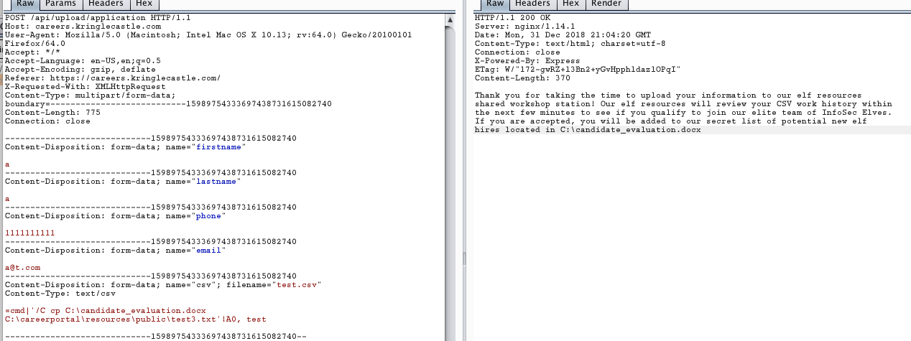

## Careers

The elfs have a career page for their openings where you upload your workhistory as a csv. Investigation reveals that the csv will be opened and checked by an elf and that their is a folder with full path information that is being publicly served.

We just need to get the file in question to that public folder to download it.

Well the only other action we can perform is file upload and there don't appear to be any attack vectors against the form. Since these are being checked by the elves we can try an csv DDE injection.

THis invovles inputing a command argument within a cell and calling it.

Yeah that worked, got to be careful when opening files.
