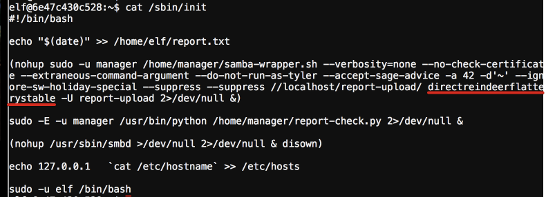
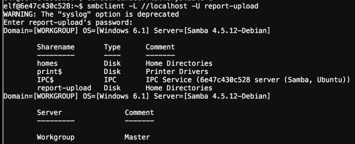

## Stall Mucking Report

This challenge provides some hint stating they utlize a lot of automation, the user typically does not need to execute anything to access their share. Participants familiar with linux automation would be familiar with numerous utilities provided by the linux system to achieve automation: cron, sbin/init, profile, systemctl, etc..

These would all be good places to look, personally I utilized the find command to search for file containing any of the user accounts and non-standard smb commands.

We find the contents of sbin/init with an unusual command with user and pass creds in cleartext.

With these credentials we can access the share on localhost.

Then we have it solved after uploading his report.

