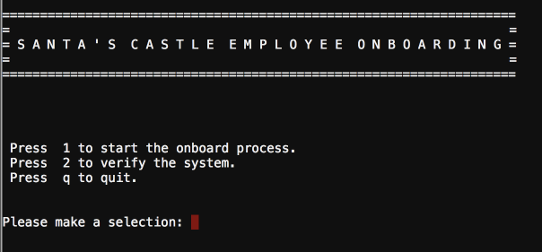
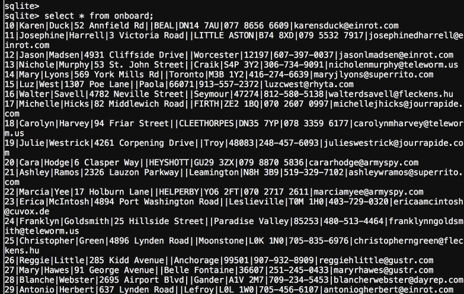
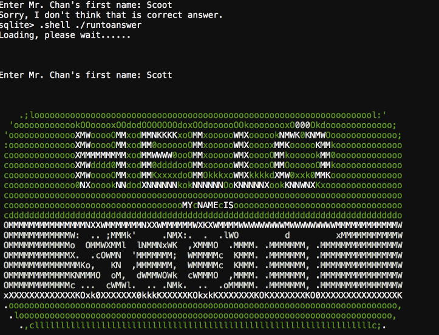

## The Name Game

This challenge required you to find the full name of an employee with the last name Chan. It presents you with their onboarding terminal application where you can register or verify the system.

After exploring functionality and input it was clear that the issue would be improper input sanitzation. The application allowed input into the ping command, where you could follow the input as a normal terminal. For example inputting the delimter character ";" would allow arbitrary execution of any following command.

Execution of ls would find the onboard.db which we have access to dump or read. Thus we opened it up with sqlite3, and retrieved the user information.

Input into runtoanswer and you got it.

