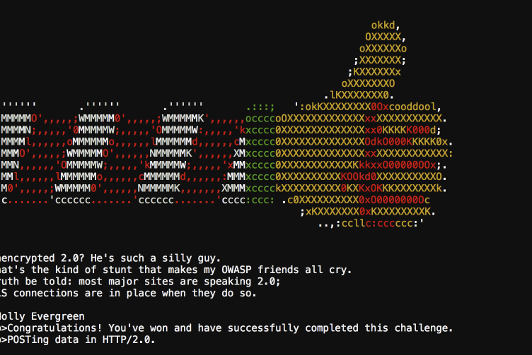

## Curling Master

In order to solve the elf gives the hint of HTTP2 being something, as well as a weird solution.

Looking at the nginx config confirms that the application is utilizing http2 on port 8080. That it is serving an index.php through fastcgi.

Posting with status=on in the body solves the challenge. Required http2-prior-knowledge

