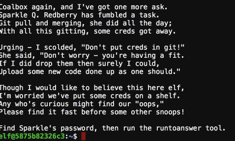
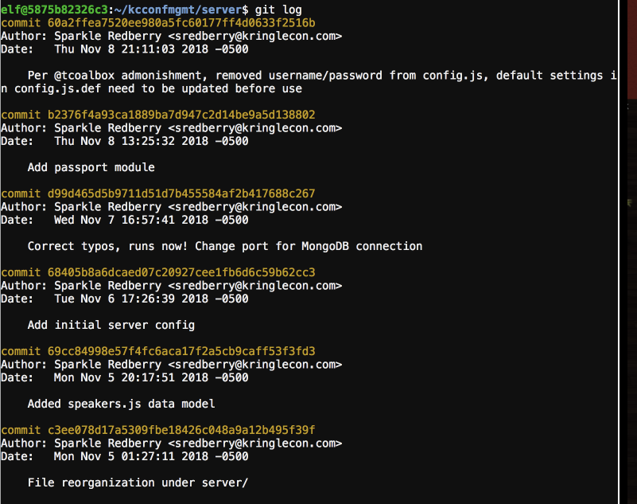
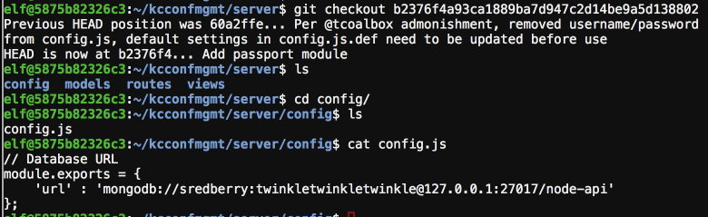
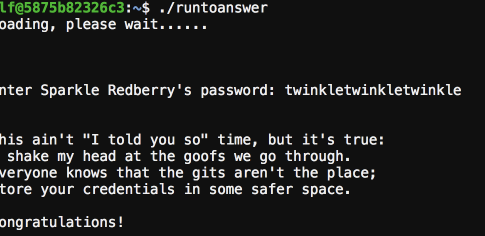

## Dev Fail

Their is a folder called kcconfmgmt, the hint tells you the password will be within the commit history.

Check the git commit history with git log after swapping to the list branch. A commit states they removed the password from the git repo in the server/config file.

Checkout the commit right before the one noted and you will find the password

There it is solved.

