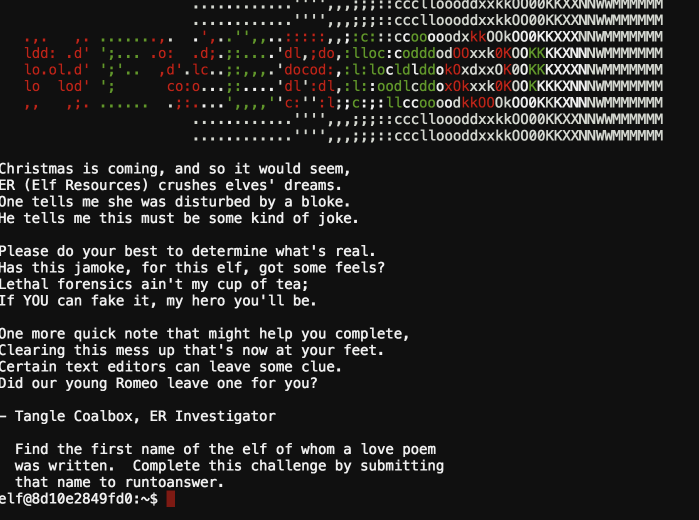
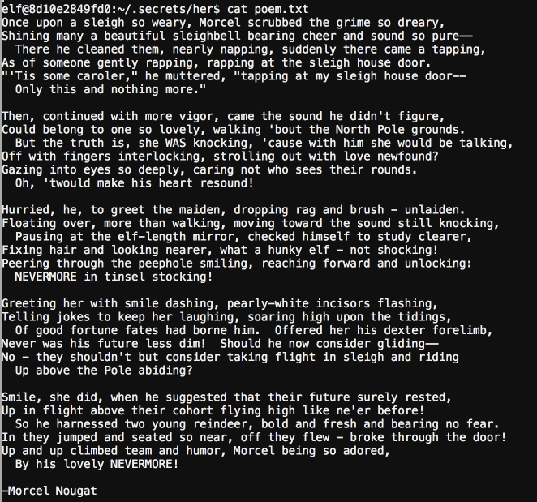
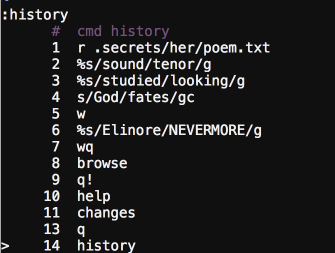

## Lethal Elfication

This one just states to find some deleted contents, aka the name of who the poem speaks about.

Well since we see .vihistory in the home directory contents I am sure it was created with VIM

Which has a history feature, so we open up the file with vi and enter the history command.

There we have the answer

