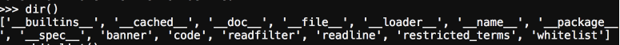

## Python Escape From Shell

For this challenge the docker container initializes into a python REPL. There a numerous ways to perform any escape typically, the simplest is of course to try executing import os or another system challenge


This does not work though as they have limited us in functionality through a whitelist. Which means we have a couple of options: beat the white list or utilize provided functionality.

Let's see what we have available.



Well now we know what is restricted.


What is this code module?


That sounds extremely useful, why don't we just open up an interactive console then?
```
code.InteractiveConsole.interact()
```


That was simple. Now you can execute commands with OS or spawn a TTY shell with pty. 


