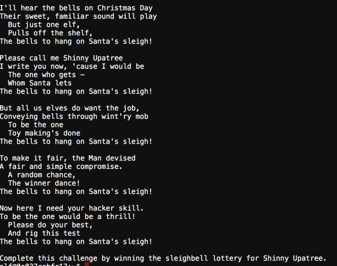
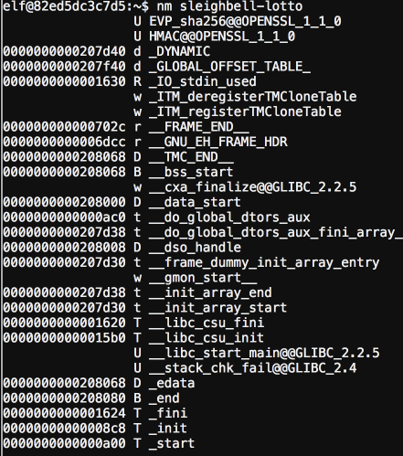
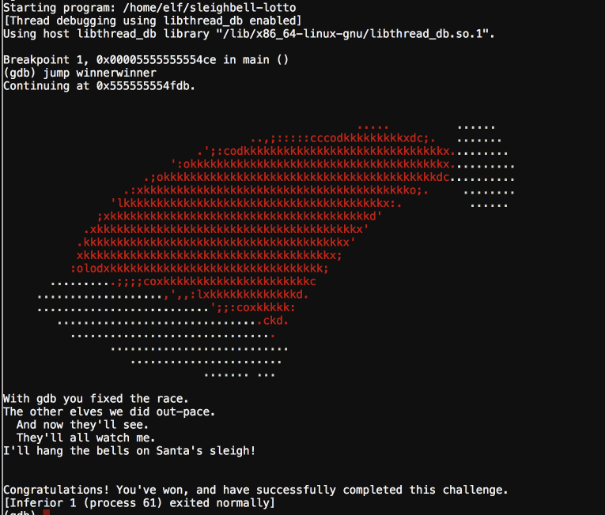

## The Sleighbell



The challenge provide the binary and access to gdb to analyze the program within the docker infra. The binary is compiled with symbols allowing for a extremeley simplified analysis proccess.

```
nm - GNU nm lists the symbols from object files objfile
```

Ran nm to list all the available functions as symbols are enabled. We see the winnerwinner fuction and can safely say that is probably what we need to call



So we open the program with gdb, set a breakpoint at main and jump to the winnerwinner function.

Then we win the lotto, if only it was like this in real-life.


