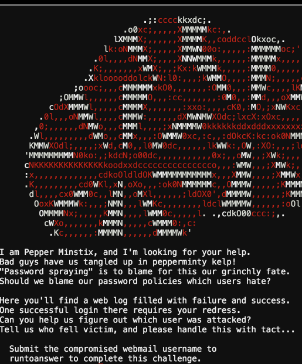
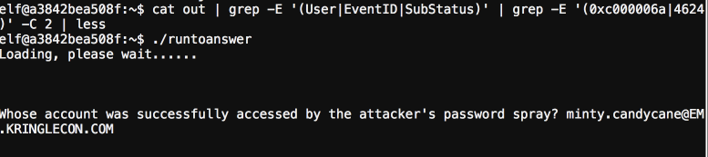

## Yule Log

The provided file is a event log file and a way to convert to csv. Once converted it is time to run linux magic to find what we seek.

We know the eventID for a successful windows login which is 4624 and that the SubStatus code for a good username but bad password is 0xc000006a

This is enough to help determine the pattern that we are looking for, as if they performed password spraying as indicated in the challenge there will be many wrong password attempts in a group period of time with an eventual success.

Thus we can search for events in series from the same source ip or just in general for a series of events where the source sent a bad password and then eventually a good login for some account.

This ends up looking like this: 

Of course this solution requires manual analysis through what is returned, this could be focused down further with regex to isolate the event further. Instead I prefer utilizing a mnaual approach at this point to ensure nothing is missed.
